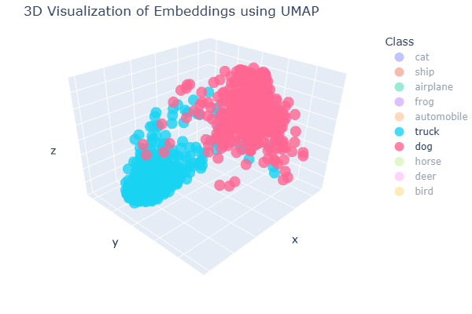
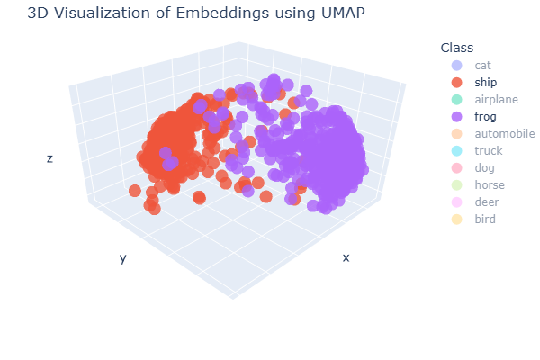

# AI research implementations

Here I gather all of the research papers and concepts related to machine learning, deep learning, natural languauge processing, computer vision and reinforcement learning that I implemented from scratch.

## Computer Vision

### Vision Transformer (ViT)
- **Paper**: "An Image is Worth 16x16 Words: Transformers for Image Recognition at Scale" (Dosovitskiy et al., 2020)
- **Implementation**: [computer_vision/vision_transformer.ipynb](computer_vision/vision_transformer.ipynb)
- **Dataset**: MNIST
- **Description**: Implementation of the Vision Transformer architecture that applies transformer models directly to image patches for image classification tasks. Visualization of attention patterns in Vision Transformer, showing how the model focuses on different parts of the image when making predictions.

## Self-Supervised Learning

### SimCLR
- **Paper**: "A Simple Framework for Contrastive Learning of Visual Representations" (Chen et al., 2020)
- **Implementation**: [self_supervised_learning/SimCLR.ipynb](self_supervised_learning/SimCLR.ipynb)
- **Dataset**: CIFAR-10
- **Description**: The notebook demonstrates how self-supervised pre-training improves downstream task performance, especially in low-data regimes (10% of labeled data) compared to supervised learning.

- **3D Embedding Visualization**
UMAP visualization of the learned embeddings shows that semantically similar classes (dogs and cats) cluster together in embedding space, while dissimilar classes (frog/ship, truck/dog) remain clearly separated - demonstrating how SimCLR captures meaningful semantic relationships without explicit labels.

  
  
  

## Natural Language Processing

### Transformer
- **Paper**: "Attention Is All You Need" (Vaswani et al., 2017)
- **Implementation**: [natural_language_processing/transformer.ipynb](natural_language_processing/transformer.ipynb)
- **Description**: Implementation of the original Transformer architecture with self-attention mechanisms.

## Reinforcement Learning

### Proximal Policy Optimization (PPO)
- **Paper**: "Proximal Policy Optimization Algorithms" (Schulman et al., 2017)
- **Implementation**: [reinforcement_learning/ppo/ppo.ipynb](reinforcement_learning/ppo/ppo.ipynb)
- **Environment**: OpenAI Gym (CartPole)
- **Description**: Modern policy optimization algorithm that constrains policy updates to improve stability during training.

### Actor-Critic
- **Paper**: "Actor-Critic Algorithms" (Konda & Tsitsiklis, 2000)
- **Implementation**: [reinforcement_learning/actor_critic/actor_critic.ipynb](reinforcement_learning/actor_critic/actor_critic.ipynb)
- **Environment**: OpenAI Gym (CartPole)
- **Description**: Combines policy gradient and value-based methods by using an actor that determines actions and a critic that evaluates them.

### REINFORCE
- **Paper**: "Sample Efficient Reinforcement Learning with REINFORCE" (Zhang et. al., 2020)
- **Implementation**: [reinforcement_learning/reinforce/reinforce.ipynb](reinforcement_learning/reinforce/reinforce.ipynb)
- **Environment**: OpenAI Gym (CartPole)
- **Description**: Policy gradient method that directly optimizes the policy without using a value function.

### Advanced Deep Q-Learning
- **Paper**: "Dueling Network Architectures for Deep Reinforcement Learning" (Wang et al., 2016) 
- **Paper**: "Prioritized Experience Replay" (Schaul et al., 2016)
- **Paper**: "Double DQN" (van Hasselt et al., 2016)
- **Implementation**: [reinforcement_learning/advanced_deep_q_learning/advanced_deep_q_learning.ipynb](reinforcement_learning/advanced_deep_q_learning/advanced_deep_q_learning.ipynb)
- **Environment**: VizDoom (Deadly Corridor)
- **Description**: Combines several advanced DQN techniques including Dueling Networks, Prioritized Experience Replay, and Double DQN.

### Deep Q-Learning (DQN)
- **Paper**: "Playing Atari with Deep Reinforcement Learning" (Mnih et al., 2013)
- **Implementation**: [reinforcement_learning/deep_q_learning/deep_q_learning.ipynb](reinforcement_learning/deep_q_learning/deep_q_learning.ipynb)
- **Environment**: VizDoom (Basic scenario)
- **Description**: Neural network-based Q-learning implementation for learning directly from raw pixels.

### Q-Learning
- **Paper**: Original Q-learning (Watkins & Dayan, 1992)
- **Implementation**: [reinforcement_learning/q_learning/q_learning.ipynb](reinforcement_learning/q_learning/q_learning.ipynb)
- **Environment**: OpenAI Gym (FrozenLake)
- **Description**: Table-based implementation of Q-learning, a model-free reinforcement learning algorithm.
